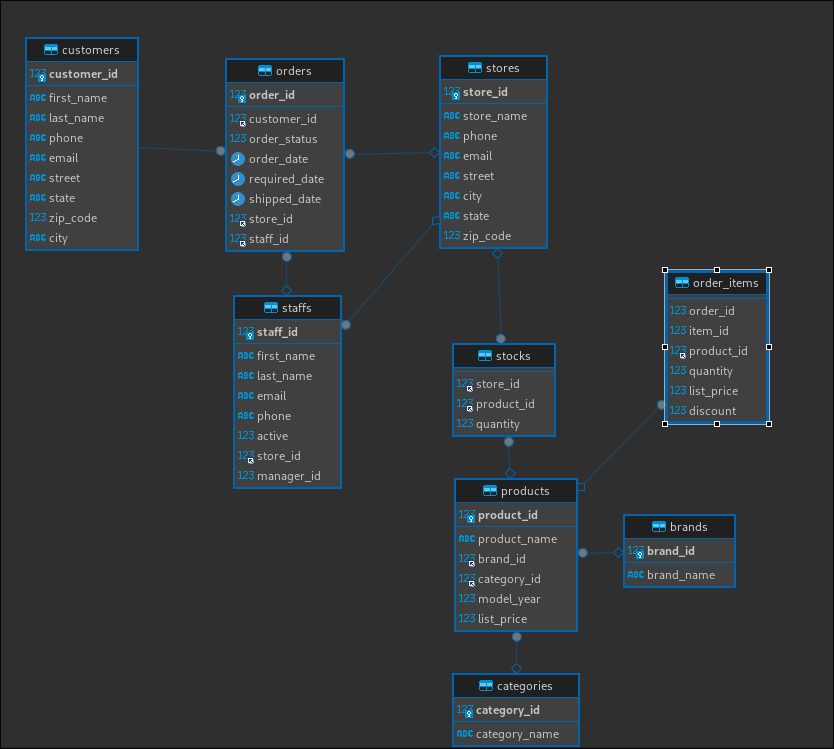
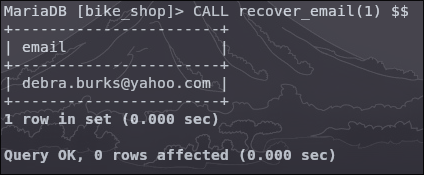
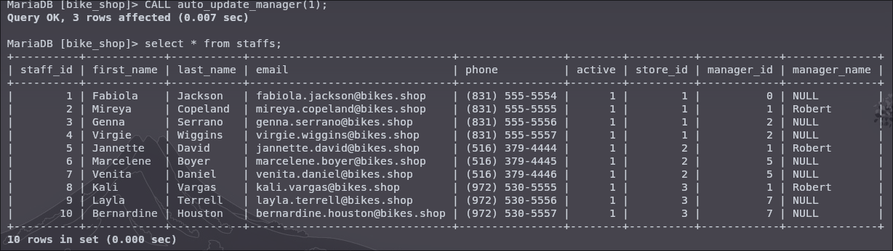
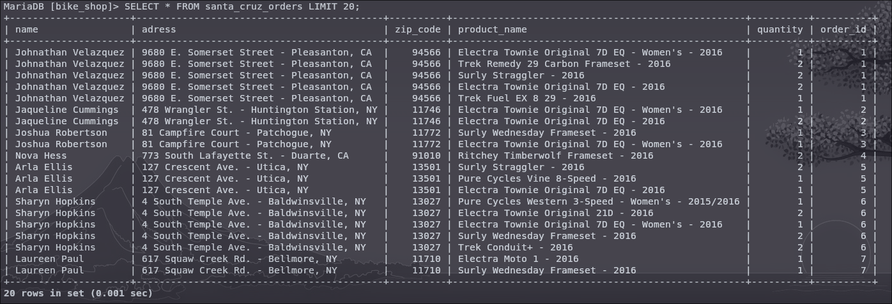
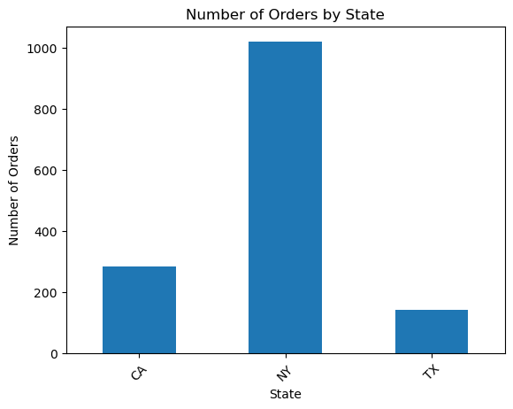
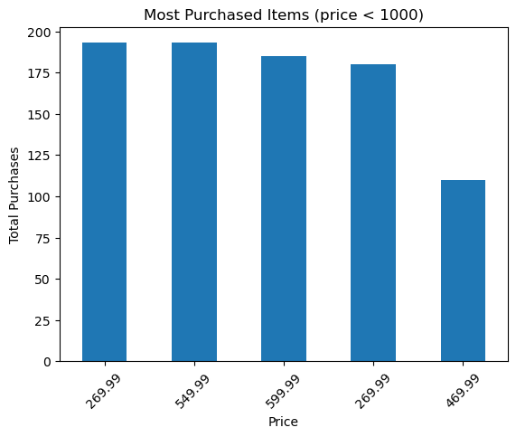
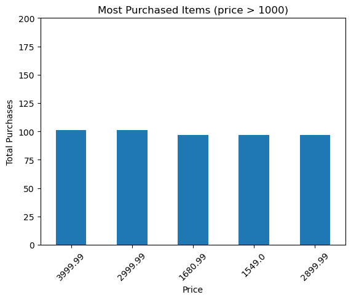
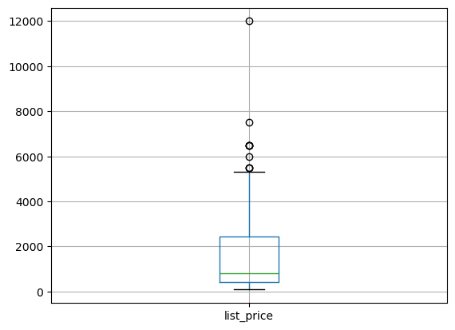

# SQL-DataViz
 Creation of a SQL Database, populating it with data and using queries to visualize the data with pandas on Python.


## Database Schema Design
Below is the Schema Design for the database. It was created to fit Kaggle's Bike Shop dataset, so I'd like to credit Dillon Myrick for creating it.
The original dataset can be found .



## Coding the Database
Below is the code used to create the database. It can also be found as creation.sql in this repository.

```sql

CREATE DATABASE bike_shop;

USE bike_shop;

CREATE TABLE brands(
  brand_id INT AUTO INCREMENT NOT NULL PRIMARY KEY,
  brand_name VARCHAR(25)
);

CREATE TABLE customers(
  customer_id AUTO INCREMENT NOT NULL PRIMARY KEY,
  first_name VARCHAR(25),
  last_name VARCHAR(25),
  phone VARCHAR(25),
  email VARCHAR(50),
  street VARCHAR(25),
  state VARCHAR(2),
  zip_code INT,
  city VARCHAR(25)
);


CREATE TABLE stores(
  store_id INT AUTO INCREMENT NOT NULL PRIMARY KEY,
  store_name VARCHAR(25),
  phone VARCHAR(25),
  email VARCHAR(50),
  street VARCHAR(25),
  city VARCHAR(25),
  state VARCHAR(2),
  zip_code INT,
);

CREATE TABLE categories(
  category_id INT AUTO INCREMENT NOT NULL PRIMARY KEY,
  category_name VARCHAR(25)
);

CREATE TABLE staffs(
  staff_id INT AUTO INCREMENT NOT NULL PRIMARY KEY,
  first_name VARCHAR(25),
  last_name VARCHAR(25),
  email VARCHAR(50),
  phone VARCHAR(25),
  active INT,
  store_id INT,
  manager_id INT NOT NULL,
  CONSTRAINT FOREIGN KEY(store_id) REFERENCES stores(store_id)
);

CREATE TABLE orders(
  order_id INT AUTO INCREMENT NOT NULL PRIMARY KEY,
  customer_id INT,
  order_status INT,
  oder_date DATE,
  required_date DATE,
  shipped_date DATE,
  store_id INT,
  staff_id INT,
  CONSTRAINT FOREIGN KEY(customer_id) REFERENCES customers(customer_id),
  CONSTRAINT FOREIGN KEY(store_id) REFERENCES stores(store_id),
  CONSTRAINT FOREIGN KEY(staff_id) REFERENCES staffs(staff_id)
);

CREATE TABLE stocks(
  store_id INT,
  product_id INT,
  quantity INT,
  CONSTRAINT FOREIGN KEY(store_id) REFERENCES stores(store_id),
  CONSTRAINT FOREIGN KEY(product_id) REFERENCES products(product_id)
);

CREATE TABLE products(
  product_id INT AUTO INCREMENT NOT NULL PRIMARY KEY,
  product_name VARCHAR(25),
  brand_id INT,
  category_id INT,
  model_year INT,
  list_price DECIMAL,
  CONSTRAINT FOREIGN KEY(brand_id) REFERENCES brands(brand_id),
  CONSTRAINT FOREIGN KEY(category_id) REFERENCES categories(category_id)
);

CREATE TABLE order_items(
  order_id INT,
  item_id INT,
  product_id INT,
  quantity INT,
  list_price DECIMAL,
  discount DECIMAL,
  CONSTRAINT FOREIGN KEY(product_id) REFERENCES products(product_id)
);
```

## Populating the database
As mentioned above, the database was created to fit the Bike Shop Dataset. The data was imported to each table in DBeaver using the built-in import CSV tool. The process was pretty straight-foward - almost no data cleaning was needed. Some null values were filled, such as the field *manager_id* present in the table *staffs*, where the null values were filled with zeroes. The reason for that decision will be discussed in the procedures section.

## Indexing

### Why index the data?
If we want to recover information about the items which price is greater than or equal to USD 1000, we can do it as such:

```sql
SELECT product_name, list_price FROM products WHERE list_price >= 1000;
```

Altough it is a very simple query, it would also be slow if we had a database with millions of entries. That happens because the underlying algorithm used in a simple search, such as the mentioned above, is a sequential search. If you want to recover a value that is present at the end of the table, it will iterate through the full table until it finds it. 
On the other hand, when you add indexes to your tables, the search will be done using BTree or Hash algorithm (more details on that below), reducing the time needed for data retrieval substantially for very large datasets.

For that reason, we can use function indexes such as the presented below to speed up the process:

```sql
CREATE INDEX list_price_over_thousand_idx ON products(list_price >= 1000);
```

And for the prices below USD 1000:

```sql
CREATE INDEX list_price_below_thousand_idx ON products(list_price < 1000);
```
### Creating our indexes
Altough indexes speed up the data retrieval process, it slows down the data insertion and update of tables. That happens because the data will also be added to the applicable indexes. Hence, it should be used in tables that will not be frequently updated.
Indexing is also unnecessary with a small amount of data, such as we have in our database here. Just for the purpose of demonstration, let's suppose we have a very large number of tuples in each of our tables, so indexing would be necessary.

Suppose our business is growing exponentially and new clients are being added to our database frequently. Indexing the customer table would not be a great idea, since it would be updated constantly.
A better candidate for indexing would be our stores table, since the number of new stores being inserted into our database would be a fraction of the customers.

If one wants to retrieve information about the store based on it's name, it could be indexed as such:

```sql
CREATE INDEX store_name_idx ON stores(store_name)
```

Now to a more complex index. Suppose we want to recover information about staff members based on the combination of their first and last names.
```sql
CREATE INDEX full_name_idx
  ON staffs(first_name, last_name);
```
Creating an index with a code such as the presented above will default to a BTree algorithm. If a Hash algorithm is desired instead, it should be specified in me moment of creation, such as in the code below:

```sql
CREATE INDEX full_name_idx
  ON staffs(first_name, last_name)
   USING HASH;
```

For now, all the indexes present in our database will be using the default BTree algorithm. The indexes that were created here will be used in the DataViz section.

## Creating procedures
Simply put, procedures are functions that are stored in memory and can be called at any time to execute a set of instructions. It would be useful to recover a customer's e-mail address using his id. The following code generate such procedure in MariaDB:

 ```sql
DELIMITER $$

CREATE PROCEDURE recover_email(IN client_id INT)
BEGIN

  SELECT email FROM customers WHERE customer_id=client_id;

END $$
```
Now calling this procedure using the CALL function passing the id 1 as argument yields the following result: </br>


The table *staffs* only identifies managers by their id. We may also want to include their name in the table. First the column *full_name* has to be created.
```sql
ALTER TABLE staffs ADD COLUMN full_name VARCHAR(50);
```
The table *staffs* only has a few tuples, so we could insert values in the newly added *full_name* column by hand. Otherwise, if the table had millions of tuples, a procedure could be created to automatic update the column with the name of the manager based on his id. We could create such procedure with the following code:
```sql
DELIMITER $$
CREATE PROCEDURE auto_update_manager(IN id INT)
 BEGIN
  IF id = 0 THEN UPDATE staffs SET manager_name = 'No Manager' WHERE manager_id = id;
  ELSEIF id = 1 THEN UPDATE staffs SET manager_name = 'Robert' WHERE manager_id = id;
  ELSEIF id = 2 THEN UPDATE staffs SET manager_name = 'Christine' WHERE manager_id = id;
  ELSEIF id = 5 THEN UPDATE staffs SET manager_name = 'Carla' WHERE manager_id = id;
  ELSEIF id = 7 THEN UPDATE staffs SET manager_name = 'Luccas' WHERE manager_id = id;
  ELSE UPDATE staffs SET manager_name = 'No information' WHERE manager_id = id;
 END IF;
END $$
DELIMITER ;
```
Now if we call this procedure passing the id 1 as argument we get the following result: </br>

All the tuples where *manager_id* was equal to 1 had the column *manager_name* updated to Robert. The same could be done for all other ids.
Note that the procedure could also be created using the CASE statement:
```sql
DELIMITER $$
CREATE PROCEDURE auto_update_manager(IN id INT)
 BEGIN
  CASE id
   WHEN id = 0 THEN UPDATE staffs SET manager_name = 'No Manager' WHERE manager_id = id;
   WHEN id = 1 THEN UPDATE staffs SET manager_name = 'Robert' WHERE manager_id = id;
   WHEN id = 2 THEN UPDATE staffs SET manager_name = 'Christine' WHERE manager_id = id;
   WHEN id = 5 THEN UPDATE staffs SET manager_name = 'Carla' WHERE manager_id = id;
   WHEN id = 7 THEN UPDATE staffs SET manager_name = 'Luccas' WHERE manager_id = id;
   ELSE UPDATE staffs SET manager_name = 'No information' WHERE manager_id = id;
 END IF;
END $$
DELIMITER ;
```

## Adding Views
Whenever an order is made, the store owner must know where to ship and who bought which item. we do not need to provide full acess to our database in order for the store owner to retrieve this information. Instead, a view could be created, which will contain only the information needed for this specific context. A view for this case could be created as such:

```sql
CREATE VIEW santa_cruz_orders AS
 SELECT
  CONCAT(c.first_name, ' ', c.last_name) as name, CONCAT(c.street, '- ', c.city, ', ', c.state) as adress, c.zip_code, p.product_name, oi.quantity, oi.order_id
 FROM
  customers as c, products as p, order_items as oi, orders as o, stores as s
 WHERE
  c.customer_id = o.customer_id AND o.order_id = oi.order_id AND oi.product_id = p.product_id AND store_id = 1;
```

The same could be done for all other stores, just modifying the *store_id* and the view's name.
A simple select all statement using this view returns a table like this: </br>


## Creating Triggers
Based on the way our database is structured, what needs to happen whenever an orders is made? We have a stocks table, so an amount equal to the ordered needs to be subtracted from this table.
```sql
DELIMITER $$

CREATE TRIGGER auto_update_stocks
BEFORE INSERT ON order_items
FOR EACH ROW
BEGIN
 UPDATE stocks SET stocks.quantity = stocks.quantity - order_items.quantity WHERE order_items.product_id = stocks.product_id;
END;
$$

DELIMITER ;
```
This will automatically update the stocks table. We can also check if the stock is enough to supply the ordered amount. In case this is false, an error will be raised and the row will not be inserted.
```sql
DELIMITER $$

CREATE TRIGGER auto_check_stocks_tg
BEFORE INSERT ON order_items
FOR EACH ROW
BEGIN 
	IF order_items.quantity > stocks.quantity THEN SIGNAL SQLSTATE '45000';
END IF;
END;
$$

DELIMITER ;
```

## Visualizing the data
The plots contained below were produced using Pandas and Matplotlib libraries for Python. The code is stored in EDA.ipynb, which can also be found in this repository. The objective was to anwer the questions presented below. Each section will include the question itself, the SQL code used to generate the CSV file for analysis and the plots. The SQL codes can also be found in queries.sql.

### What is the number of orders made in each state?
```sql
SELECT count(o.order_id) as total_orders, s.store_id, s.store_name, s.state  FROM orders as o, stores as s WHERE o.store_id=s.store_id GROUP BY s.store_id;
```


### What was each store's revenue?

```sql
SELECT SUM(oi.list_price * oi.quantity) as revenue, s.store_name  FROM order_items as oi, stores as s, orders as o WHERE oi.order_id =o.order_id AND o.store_id=s.store_id GROUP BY store_name;
```


### If we split the products in two categories, the first being products which price is above than 1000 USD, and the second being products below this price, how do the sales compare?
For the items with price below 1000 USD:
```sql
SELECT p.product_name, oi.list_price, count(oi.order_id) as total_orders FROM order_items as oi, products as p WHERE oi.product_id=p.product_id GROUP BY product_name HAVING oi.list_price < 1000 ORDER BY total_orders DESC;
```


For the items with price above 1000 USD:
```sql
SELECT p.product_name, oi.list_price, count(oi.order_id) as total_orders FROM order_items as oi, products as p WHERE oi.product_id=p.product_id GROUP BY product_name HAVING oi.list_price > 1000 ORDER BY total_orders DESC;
```


### What is the distribution of the prices in this dataset?


## Extras
There are some queries that were not used in the data visualization section. Either they can't be used to produce a plot or they would generate redundant information. Below are those queries.

### What is the sales average?
```sql
SELECT AVG(o.order_id) as orders_average FROM orders as o, stores as s WHERE o.store_id=s.store_id;
```

### What were the minimum and maximum number of orders made by the same client?
This was an interesting one. The code below shows that each client made a single purchase in the store, with a single exception who made two purchases.

```sql
SELECT CONCAT(c.first_name,' ', c.last_name) as full_name, count(o.order_id) AS number_of_purchases FROM orders as o, customers as c WHERE o.customer_id=c.customer_id GROUP BY full_name ORDER BY number_of_purchases DESC LIMIT 5;
```

Could it be that two clients have the same name? We shall investigate.
```sql
SELECT CONCAT(first_name, ' ', last_name) as full_name, customer_id  from customers WHERE first_name="Justina" AND last_name="Jenkins";
```

The code above returns two entries with the same name and different client ids. Either the store generates a new client id each time a client makes an order or there really are two clients with the same name. Unfortunately, we don't have enough data to explore that further.

