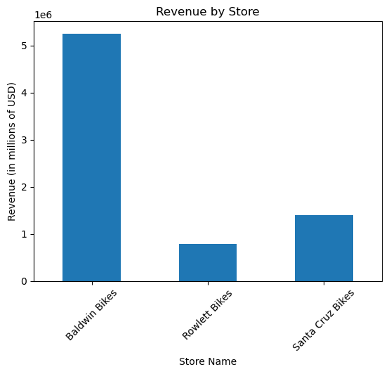

# SQL-DataViz
 Creation of a SQL Database, populating it with data and using queries to visualize the data with pandas on Python.


## Database Schema Design
Below is the Schema Design for the database. It was created to fit Kaggle's Bike Shop dataset, so I'd like to credit Dillon Myrick for creating it.
The original dataset can be found .


## Coding the Database
Below is the code used to create the database. It can also be found as creation.sql in this repository.

```sql

CREATE DATABASE bike_shop;

USE bike_shop;

CREATE TABLE brands(
  brand_id INT AUTO INCREMENT NOT NULL PRIMARY KEY,
  brand_name VARCHAR(25)
);

CREATE TABLE customers(
  customer_id AUTO INCREMENT NOT NULL PRIMARY KEY,
  first_name VARCHAR(25),
  last_name VARCHAR(25),
  phone VARCHAR(25),
  email VARCHAR(50),
  street VARCHAR(25),
  state VARCHAR(2),
  zip_code INT,
  city VARCHAR(25)
);


CREATE TABLE stores(
  store_id INT AUTO INCREMENT NOT NULL PRIMARY KEY,
  store_name VARCHAR(25),
  phone VARCHAR(25),
  email VARCHAR(50),
  street VARCHAR(25),
  city VARCHAR(25),
  state VARCHAR(2),
  zip_code INT,
);

CREATE TABLE categories(
  category_id INT AUTO INCREMENT NOT NULL PRIMARY KEY,
  category_name VARCHAR(25)
);

CREATE TABLE staffs(
  staff_id INT AUTO INCREMENT NOT NULL PRIMARY KEY,
  first_name VARCHAR(25),
  last_name VARCHAR(25),
  email VARCHAR(50),
  phone VARCHAR(25),
  active INT,
  store_id INT,
  manager_id INT NOT NULL,
  CONSTRAINT FOREIGN KEY(store_id) REFERENCES stores(store_id)
);

CREATE TABLE orders(
  order_id INT AUTO INCREMENT NOT NULL PRIMARY KEY,
  customer_id INT,
  order_status INT,
  oder_date DATE,
  required_date DATE,
  shipped_date DATE,
  store_id INT,
  staff_id INT,
  CONSTRAINT FOREIGN KEY(customer_id) REFERENCES customers(customer_id),
  CONSTRAINT FOREIGN KEY(store_id) REFERENCES stores(store_id),
  CONSTRAINT FOREIGN KEY(staff_id) REFERENCES staffs(staff_id)
);

CREATE TABLE stocks(
  store_id INT,
  product_id INT,
  quantity INT,
  CONSTRAINT FOREIGN KEY(store_id) REFERENCES stores(store_id),
  CONSTRAINT FOREIGN KEY(product_id) REFERENCES products(product_id)
);

CREATE TABLE products(
  product_id INT AUTO INCREMENT NOT NULL PRIMARY KEY,
  product_name VARCHAR(25),
  brand_id INT,
  category_id INT,
  model_year INT,
  list_price DECIMAL,
  CONSTRAINT FOREIGN KEY(brand_id) REFERENCES brands(brand_id),
  CONSTRAINT FOREIGN KEY(category_id) REFERENCES categories(category_id)
);

CREATE TABLE order_items(
  order_id INT,
  item_id INT,
  product_id INT,
  quantity INT,
  list_price DECIMAL,
  discount DECIMAL,
  CONSTRAINT FOREIGN KEY(product_id) REFERENCES products(product_id)
);
```

## Populating the database
As mentioned above, the database was created to fit the Bike Shop Dataset. The data was imported to each table in DBeaver using the built-in import CSV tool. The process was pretty straight-foward - almost no data cleaning was needed. Some null values were filled, such as the field *manager_id* present in the table *staffs*, where the null values were filled with zeroes.

## Visualizing the data
The plots contained below were produced using Pandas and Matplotlib libraries for Python. The code is stored in EDA.ipynb, which can also be found in this repository. The objective was to anwer the questions presented below. Each section will include the question itself, the SQL code used to generate the CSV file for analysis and the plots. The SQL codes can also be found in queries.sql.

### What is the number of orders made in each state?
```sql
SELECT count(o.order_id) as total_orders, s.store_id, s.store_name, s.state  FROM orders as o, stores as s WHERE o.store_id=s.store_id GROUP BY s.store_id;
```


### What was each store's revenue?

```sql
SELECT SUM(oi.list_price * oi.quantity) as revenue, s.store_name  FROM order_items as oi, stores as s, orders as o WHERE oi.order_id =o.order_id AND o.store_id=s.store_id GROUP BY store_name;
```


### If we split the products in two categories, the first being products which price is above than 1000 USD, and the second being products below this price, how do the sales compare?
For the items with price below 1000 USD:
```sql
SELECT p.product_name, oi.list_price, count(oi.order_id) as total_orders FROM order_items as oi, products as p WHERE oi.product_id=p.product_id GROUP BY product_name HAVING oi.list_price < 1000 ORDER BY total_orders DESC;
```


For the items with price above 1000 USD:
```sql
SELECT p.product_name, oi.list_price, count(oi.order_id) as total_orders FROM order_items as oi, products as p WHERE oi.product_id=p.product_id GROUP BY product_name HAVING oi.list_price > 1000 ORDER BY total_orders DESC;
```


### What is the distribution of the prices in this dataset?


## Extras
There are some queries that were not used in the data visualization section. Either they can't be used to produce a plot or they would generate redundant information. Below are those queries.

### What is the sales average?
```sql
SELECT AVG(o.order_id) as orders_average FROM orders as o, stores as s WHERE o.store_id=s.store_id;
```

### What were the minimum and maximum number of orders made by the same client?
This was an interesting one. The code below shows that each client made a single purchase in the store, with a single exception who made two purchases.

```sql
SELECT CONCAT(c.first_name,' ', c.last_name) as full_name, count(o.order_id) AS number_of_purchases FROM orders as o, customers as c WHERE o.customer_id=c.customer_id GROUP BY full_name ORDER BY number_of_purchases DESC LIMIT 5;
```

Could it be that two clients have the same name? We shall investigate.
```sql
SELECT CONCAT(first_name, ' ', last_name) as full_name, customer_id  from customers WHERE first_name="Justina" AND last_name="Jenkins";
```

The code above returns two entries with the same name and different client ids. Either the store generates a new client id each time a client makes an order or there really are two clients with the same name. Unfortunately, we don't have enough data to explore that further.

